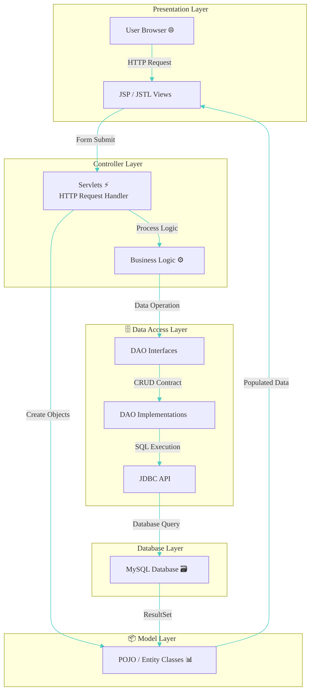
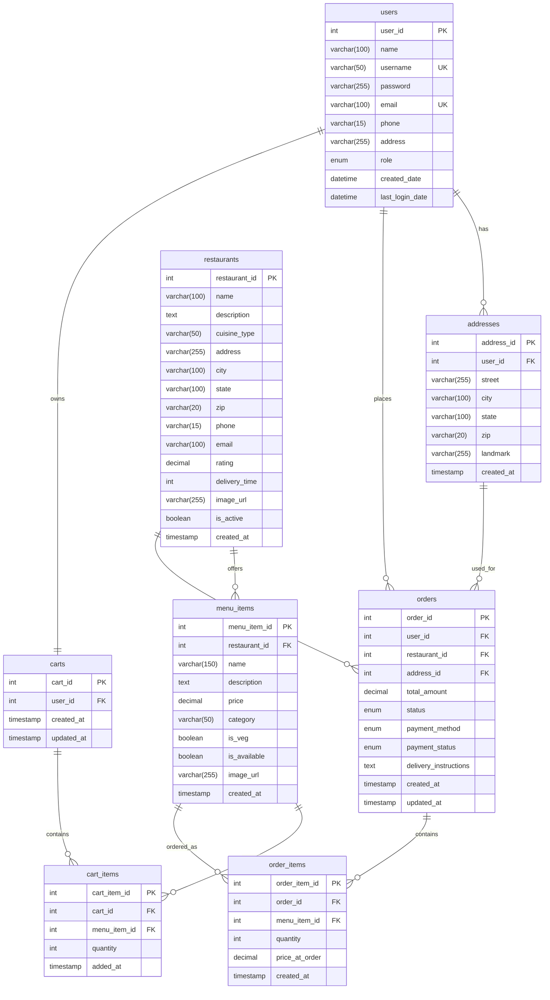
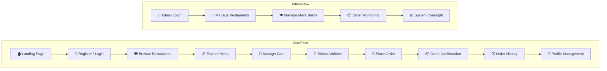

# 🍔 FoodXpress – Full-Stack Food Delivery Web Application

A **production-style food order web application** built using **Java EE, JSP, Servlets, JDBC, and MySQL**, following the **MVC (Model–View–Controller) architecture**.
**FoodXpress** simulates a real-world online food ordering platform where users can **discover restaurants 🍽️, explore menus 📋, manage carts 🛒, place orders 🚀, and track order history 📦** — similar to popular platforms like **Swiggy** and **Zomato**.

<p align="center">
  
</p>

---
## ✨ Elevator Pitch

**FoodXpress** is a full-stack **food delivery web application** designed to digitize the traditional restaurant ordering experience using **core Java EE technologies**.

- The platform enables users to **register and log in securely 🔐**
- Browse restaurants 🍽️
- Explore dynamic menus 📋
- Add items to a persistent cart 🛒
- Place orders 🚀
- Track their complete order history 📦 through a clean, user-friendly interface

- Built using a **layered MVC architecture**
- FoodXpress demonstrates real-world backend engineering practices such as:
  - **Servlet-based request handling**
  - **DAO abstraction**
  - **JDBC-driven database interaction**
  - **Session management**
  - **Secure authentication**
- Making it a strong showcase of **end-to-end Java full-stack development**

---
## 📸 Demo & Screenshots

Below is a visual walkthrough of **FoodXpress**, showcasing key user flows and core features of the application — from authentication to order completion 📦🚀

### 🏠 User Journey Screens

<p align="center">
  
  
</p>

<p align="center">
  
  
</p>

---

### 🍽️ Browsing & Ordering Flow

<p align="center">
  
  
</p>

<p align="center">
  
  
</p>

---

### ✅ Order Completion & History

<p align="center">
  
  
</p>

---
## 🎯 Key Features

### 👤 User Features
- 🔐 Secure **User Registration & Login** with session management
- 🏠 Personalized **User Dashboard** after authentication
- 🍽️ Browse available **Restaurants** with detailed listings
- 📋 View **Dynamic Menus** with real-time item data
- 🛒 **Add to Cart** functionality with quantity management
- 📍 Manage **Delivery Addresses** for order placement
- 🚀 Smooth **Checkout Flow** with order confirmation
- 📦 View **Order Success** and detailed **Order History**
- 👤 Update and manage **User Profile** information

### 🛠️ System & Backend Features
- 🧱 Clean **MVC (Model–View–Controller)** architecture
- 🔄 **Servlet-based request handling** and routing
- 🗄️ **DAO pattern** for database abstraction
- 🔌 **JDBC integration** with MySQL for persistent storage
- 🔐 **Session tracking** for authenticated user flows
- ⚠️ Centralized **validation & error handling**
- 🧹 Modular and maintainable **project structure**

### 💻 Frontend & UX Features
- 🎨 Clean, intuitive, and user-friendly UI
- 📱 Responsive layouts for different screen sizes
- ⚡ Dynamic page rendering using **JSP**
- 🧭 Simple navigation flow across all modules
- ✅ Clear user feedback for actions and status updates

---
## 🛠️ Technology Stack

| Tool / Technology | Badge | Description |
|-------------------|-------|-------------|
| **Java (JDK 17)** |  | Core backend language used for business logic, servlets, DAO layers, and application flow |
| **JSP** | -007396?style=for-the-badge&logo=java&logoColor=white) | View layer technology for rendering dynamic web pages |
| **Servlets** |  | Controller layer handling HTTP requests, responses, and routing |
| **JDBC** |  | Java API used for database connectivity and SQL execution |
| **MySQL** |  | Relational database for storing users, restaurants, menus, carts, and orders |
| **HTML5** |  | Markup language for structuring web pages |
| **CSS3** |  | Styling and layout design for responsive UI |
| **JavaScript** |  | Client-side interactions and UI behavior |
| **Apache Tomcat 9** |  | Servlet container used to deploy and run the application |
| **Eclipse IDE** |  | Development environment used for building and debugging the project |
| **Maven** |  | Build automation and dependency management |
| **Git** |  | Version control system for source code management |
| **GitHub** |  | Repository hosting and project showcasing platform |

---

## 🏗️ Architecture

### 🔄 MVC Architecture Flow


---

```text
FoodApp/
├── 📦 src/main/java/com/app
│   ├── 🧠 ## controllers/                # Handles HTTP requests & responses
│   │   ├── AddressServlet.java
│   │   ├── AdminMenuServlet.java
│   │   ├── AdminRestaurantServlet.java
│   │   ├── CartServlet.java
│   │   ├── CheckoutServlet.java
│   │   ├── MenuServlet.java
│   │   ├── OrderHistoryServlet.java
│   │   ├── OrderSuccessServlet.java
│   │   ├── OrderSummaryServlet.java
│   │   ├── PaymentServlet.java
│   │   ├── RestaurantServlet.java
│   │   └── UserServlet.java
│   │
│   ├── 📜 dao/                        # DAO interfaces (contracts)
│   │   ├── AddressDAO.java
│   │   ├── CartDAO.java
│   │   ├── MenuItemDAO.java
│   │   ├── OrderDAO.java
│   │   ├── RestaurantDAO.java
│   │   └── UserDAO.java
│   │
│   ├── 💾 dao_implementation/         # DAO implementations (JDBC logic)
│   │   ├── AddressDAOImpl.java
│   │   ├── CartDAOImpl.java
│   │   ├── MenuItemDAOImpl.java
│   │   ├── OrderDAOImpl.java
│   │   ├── RestaurantDAOImpl.java
│   │   └── UserDAOImpl.java
│   │
│   ├── 📦 models/                     # POJO / Entity classes
│   │   ├── Address.java
│   │   ├── Cart.java
│   │   ├── CartItem.java
│   │   ├── MenuItem.java
│   │   ├── Order.java
│   │   ├── OrderItem.java
│   │   ├── Restaurant.java
│   │   └── User.java
│   │
│   ├── 🔐 filters/                    # Authentication & authorization
│   │   └── AuthFilter.java
│   │
│   ├── ⚙️ utility/                    # Common utilities
│   │   └── DBConnection.java
│   │
│   └── 🧪 test/                       # Unit & integration tests
│       ├── TestDBConnection.java
│       └── TestUserDAO.java
│
├── ⚙️ src/main/resources
│   └── app.properties                 # Application configuration
│
├── 🌐 src/main/webapp                 # View layer (JSP + static assets)
│   ├── 🎨 assets/
│   │   ├── css/
│   │   ├── images/
│   │   └── javascript/
│   │
│   ├── 📄 jsp/
│   │   ├── 🛡️ admin/                  # Admin UI
│   │   │   ├── dashboard.jsp
│   │   │   ├── addRestaurant.jsp
│   │   │   ├── editRestaurant.jsp
│   │   │   ├── menuListAdmin.jsp
│   │   │   └── restaurantListAdmin.jsp
│   │   │
│   │   ├── 👥 customer/               # Customer UI
│   │   │   ├── home.jsp
│   │   │   ├── restaurantList.jsp
│   │   │   ├── restaurantDetails.jsp
│   │   │   ├── cart.jsp
│   │   │   ├── checkout.jsp
│   │   │   ├── order_summary.jsp
│   │   │   ├── orderSuccess.jsp
│   │   │   ├── orderHistory.jsp
│   │   │   ├── profile.jsp
│   │   │   └── addresses.jsp
│   │   │
│   │   └── 🔗 shared/                 # Reusable JSP fragments
│   │       ├── header.jspf
│   │       ├── footer.jspf
│   │       └── head.jspf
│   │
│   ├── 🔐 login.jsp
│   ├── 📝 register.jsp
│   ├── 🏠 index.jsp
│   │
│   └── ⚙️ WEB-INF/
│       └── web.xml                    # Servlet & filter configuration
│
├── 📸 screenshots/                    # Application UI screenshots
│
├── 📦 pom.xml                         # Maven dependencies & build config
└── 📖 README.md                       # Project documentation
```
---
## 📊 Database Design

### 🗃️ Complete Database Schema

FoodXpress uses a **relational MySQL database** with **8 normalized tables** following **3rd Normal Form (3NF)**. The design ensures **data integrity, scalability, and performance** for handling thousands of concurrent food orders.

---

### 🔗 Entity-Relationship Diagram


---
## 🚀 Getting Started

Follow the steps below to **set up and run FoodXpress locally** on your system.

---

### ✅ Prerequisites

Ensure the following tools are installed before running the project:

- ☕ **Java JDK 17**
- 🌐 **Apache Tomcat 9**
- 🗄️ **MySQL Server**
- 🛠️ **Eclipse IDE** (Recommended for Java EE projects)
- 🔄 **Git** (for cloning the repository)

---

### ⚙️ Installation

1. **Clone the repository**
   ```bash
   git clone https://github.com/pratikp3280/FoodXpress.git
   ```

2. **Import into Eclipse**
   - Open **Eclipse**
   - Go to: `File → Import → Existing Maven Projects`
   - Select the cloned `FoodXpress/FoodApp` directory
   - Finish the import

---

### 🗄️ Database Setup

1. Open **MySQL** and create the database:
   ```sql
   CREATE DATABASE food_delivery_app;
   ```

2. Execute the provided SQL scripts to create tables:
   - `users`
   - `addresses`
   - `restaurants`
   - `menu_items`
   - `carts`
   - `cart_items`
   - `orders`
   - `order_items`

3. Ensure the database is running on:
   - **Host**: `localhost`
   - **Port**: `3306`

---

### 🔧 Configuration

1. Open the configuration file:
   ```text
   src/main/resources/app.properties
   ```

2. Update your MySQL credentials:
   ```properties
   db.url=jdbc:mysql://localhost:3306/food_delivery_app
   db.username=your_mysql_username
   db.password=your_mysql_password
   ```

3. Save the file after updating the credentials.

---

### ▶️ Running the Server

1. Right-click the project in **Eclipse**
2. Select: `Run As → Run on Server`
3. Choose **Apache Tomcat 9**
4. Finish and wait for deployment

Once the server starts, access the application at:
   ```text
   http://localhost:8080/FoodXpress/
   ```
---
## Flow Diagrams


## 🔐 Security Implementation

FoodXpress implements essential web application security practices to protect user data, restrict unauthorized access, and ensure safe request handling.

---

### 🔑 Authentication & Authorization

- **Session-based authentication** using `HttpSession`
- Maintains user identity across requests after login
- **Role-based access control** for:
  - Customers
  - Admins
- Unauthorized users are redirected to the login page

---

### 🛡️ Route Protection (Servlet Filters)

- Protected URLs secured using a custom `AuthFilter`
- Filter checks:
  - Active user session
  - Valid user role before allowing access
- Prevents direct access to:
  - Admin JSP pages
  - Order, cart, and checkout endpoints

---

### 🗄️ Secure Data Handling

- User credentials stored securely in the database
- Sensitive operations validated server-side
- Database access abstracted using **DAO pattern**
- No direct database access from JSP pages

---

### ⚠️ Input Validation & Error Handling

- Server-side validation for:
  - Login and registration forms
  - Address and order data
- Graceful error handling for invalid inputs
- User-friendly error messages without exposing system details

---

### 🧼 Session & Resource Manage
- Automatic session invalidation on logout
- Prevents session fixation by regenerating sessions after login
- Proper closing of JDBC resources to avoid leaks

---

### 🎯 Security Design Highlights

- Authentication handled at the controller level
- Authorization enforced via servlet filters
- MVC separation prevents logic leakage to views
- Database operations isolated from presentation layer

---
## 🔧 Technical Details

This section provides an overview of FoodXpress's **backend design**, **request flow**, and **core implementation patterns**.

---

### 🧱 MVC Request–Response Lifecycle

1. 🌐 **JSP UI**: Users interact with JSPs for input.
2. 📤 **Servlet Controllers**: Handle HTTP requests, validate inputs, manage sessions, and execute business logic.
3. 🗄️ **DAO Layer**: Delegates database operations using DAO interfaces and JDBC for MySQL interaction.
4. 📋 **Data Mapping**: Retrieved data is converted to POJO/entity objects.
5. 📥 **Response Rendering**: Data is sent back to JSP views for the user.

---

### 🗂️ DAO Pattern

- 📜 **Interfaces**: Define database operations for loose coupling and easy testing.
- 💾 **Implementations**: Include SQL logic and handle JDBC operations (connections, statements, result sets).
- 🔄 **Flexibility**: Switch persistence mechanisms without affecting the app’s controllers.

---

### 🔌 JDBC Connection Management

- 🔗 Centralized `DBConnection` utility for managing database connections.
- 📄 Connection properties loaded from `app.properties`, ensuring flexibility.
- 🧹 Proper resource handling to close:
  - Connections
  - Statements
  - ResultSets

---

### 🧾 Session Management

- 🔐 User sessions established post-login, storing user IDs and roles (customer/admin).
- ⏱️ Sessions validated for all protected routes.
- 🚪 Explicit session invalidation during logout.

---

### 🧪 Form Handling & Validation

- ❌ **Server-Side Validation**: Ensures inputs like login and registration data are properly checked.
- 📢 Error messages are forwarded to JSPs with meaningful user feedback.
- 🚫 Prevents invalid data submission and app crashes.

---

### ⚙️ Application Configuration

- 🗂️ **Centralized Settings**: Stored in `app.properties`, including:
  - 🔑 Database URL
  - 🔑 Credentials
- 📦 Prevents hardcoding sensitive values into the codebase.

---

### 🎯 Technical Highlights

- 🧠 **Separation of Concerns**: MVC ensures clear modular design.
- 🔄 **Reusable Persistence Layer**: DAO-based, easily testable and modular.
- 🔐 **Secure Design**: Session-based authentication and validation for all routes.
- 🧱 **Scalability**: A maintainable, structured codebase tailored for real-world Java EE projects.
- 🛠️ **Standard Practices**: Built on robust Java EE design principles.

---
## 🎖️ Project Highlights

FoodXpress goes beyond a basic CRUD application — it simulates a **real-world food delivery platform** with clean architecture, scalable design, and production-like workflows.

---

### 🌟 What Makes FoodXpress Stand Out

- 🧱 **Java EE Core**: Built with **Servlets + JSP**, avoiding heavy frameworks.
- 🏗️ **Clean MVC Architecture**: Enforces strict separation of concerns.
- 🗄️ **Relational Database Schema**: Inspired by real-world food delivery systems.
- 🔄 **DAO Abstraction**: Interface-based database operations for flexibility.
- 🔐 **Session-Based Authentication**: Secured using servlet filters.
- 🛒 **Persistent Cart**: Database-backed cart storage for seamless user experience.
- 📦 **Order Management**: Full order lifecycle implementation.
- 📍 **Multiple Delivery Addresses**: Support for multiple addresses per user.
- 🧪 **Server-Side Validation**: Ensures data integrity and robust error handling.

---

### 👨‍💻 Engineering-Focused Highlights

- 📁 **Enterprise-Style Folder Structure**: Organized for real-world development.
- 🧠 **Clear Request–Response Lifecycle**: Designed for maintainability and scalability.
- 🔌 **Centralized JDBC Management**: Reusable connection utility for all database operations.
- 🧩 **Modular, Maintainable Code**: Encourages reuse and simplifies future development.
- ⚙️ **Externalized Configurations**: Secure `app.properties` setup for flexibility.
- 🚀 **Extensible Design**: Easy to add new features and scale the system.

---

## 🔮 Future Enhancements

The following enhancements focus on **scalability, security, user experience, and production readiness**, adding maximum real-world value to **FoodXpress**.

### 🚀 High-Impact Enhancements

- 🔐 **Advanced Authentication & Security**
  - Password hashing (BCrypt)
  - Forgot password & secure reset flow
  - CSRF & XSS protection

- 💳 **Online Payment Gateway Integration**
  - UPI / Card payment support
  - Payment verification & status tracking

- 🚴 **Delivery Partner Module**
  - Assign orders to delivery agents
  - Real-time order status updates

- ⭐ **User Reviews & Ratings System**
  - Rate restaurants and food items
  - Improve trust and discovery experience

- 📱 **Responsive & Mobile-First UI**
  - Optimized layouts for mobile & tablet
  - Enhanced UI interactions & usability

- 🧠 **Architecture Upgrade (Spring Boot + REST APIs)**
  - Migrate to Spring Boot
  - Expose REST APIs for mobile app integration
---

## 📬 Contact Information

👨‍💻 **Developer:** Harsh Sharma and Hrushikesh Dev
🎓 **Role:** Software Developer 
📱 **Mobile:** +91-9767755630 
📧 **Email:** harsh.sharma4131@gmail.com  

### 🌐 Connect With Me

<p align="left">
  <a href="https://github.com/pratikp3280" target="_blank">
    
  </a>
  
  <a href="https://www.linkedin.com/in/harsh-sharma4131/" target="_blank">
    
  </a>
  
  <a href="mailto:harsh.sharma@gmail.com">
    
  </a>
</p>

---
⭐ *If you found this project useful, feel free to star the repository and connect with me!* 🚀
